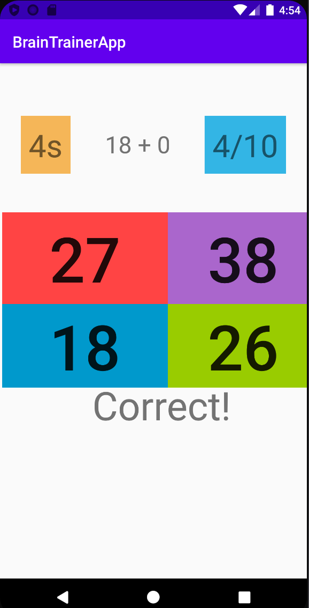
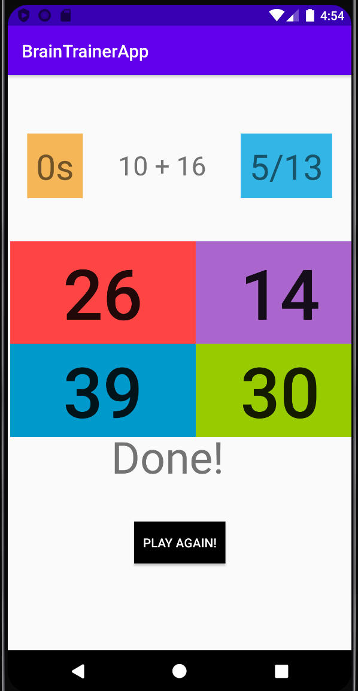

# Brain Trainer App

A fun brain training game that lets you compute sum of random numbers and check your answers while a timer is running.

### Some Features

- Begins with a GO button
- Randomly generated positions for correct answer
- Randomly generated options as answers
- Randomly generated numbers to compute sum
- Interactive UI
- Displays appropriate correct/wrong/done messages throughout the game
- Countdown timer
- Instant score updates
- Can choose to play again as many times as desired
- Stops the game as timer finishes

Developed in Java using Android Studio

